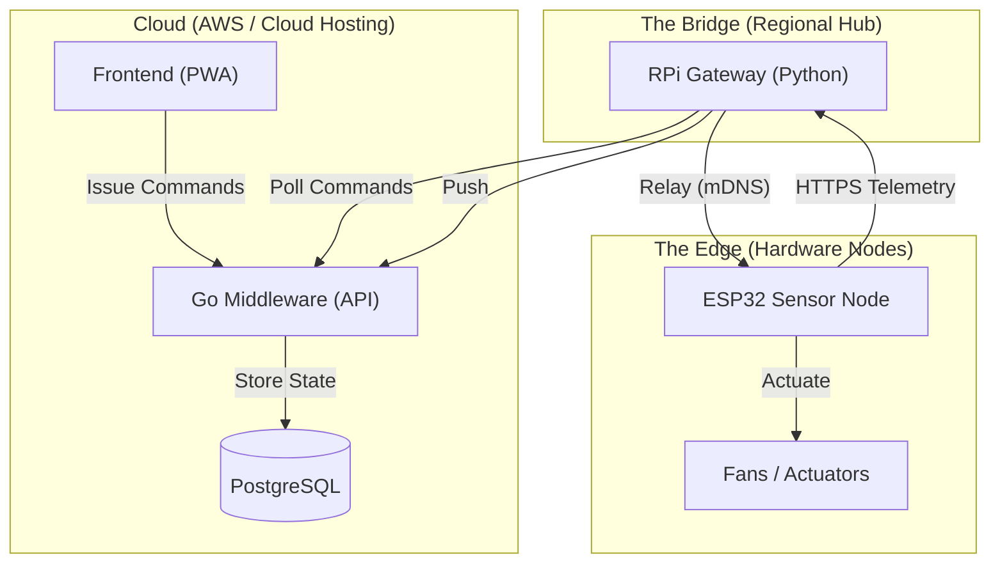

# 🐔 Tokkatot: Smart Agri-Tech Platform

[](https://tokkatot.com)
[](#zero-config-discovery)
[](#cloud-infrastructure)

**Tokkatot** (Toggle + Tot) is a premium, 3-tier IoT platform designed for modern poultry farming. It bridges the gap between local sensor data and cloud-based management, allowing farmers to monitor and control their environment from anywhere in the world.

---

## 🏗️ System Architecture

Tokkatot operates on a distributed "Cloud-to-Edge" architecture:



---

## 🚀 Key Features

### 1. Zero-Config Discovery
No more hardcoded IP addresses. Using **mDNS**, the Raspberry Pi gateway automatically discovers sensors on the local network as `tokkatot-sensor.local`. You can move your hardware to any WiFi router, and it will "just work."

### 2. Full-Stack Control Loop
Toggle fans, heaters, or feeders directly from your phone. Our **bi-directional relay** ensures that commands issued in the cloud are executed at the edge in near real-time.

### 3. Offline Resilience
The Gateway includes a **SQLite Telemetry Queue**. If your internet goes down, the Pi will store all sensor data locally and automatically sync it to the cloud as soon as the connection is restored.

---

## 📂 Repository Structure

- [**`middleware/`**](file:///c:/Users/PureGoat/tokkatot/middleware): The high-performance Go API. Handles authentication, telemetry ingestion, and command queuing.
- [**`frontend/`**](file:///c:/Users/PureGoat/tokkatot/frontend): A modern, responsive PWA for monitoring farm health.
- [**`gateway/`**](file:///c:/Users/PureGoat/tokkatot/gateway): Python-based software for the Raspberry Pi. Acts as the bridge between local sensors and the cloud.
- [**`embedded/`**](file:///c:/Users/PureGoat/tokkatot/embedded): ESP-IDF firmware for the ESP32. Handles sensors (DHT11, Water Level) and actuator control via HTTPS.

---

## 🛠️ Getting Started

### 1. Provision the Gateway
Flash Ubuntu Server to your Raspberry Pi and run the installer:
```bash
curl -sSf https://raw.githubusercontent.com/SirOsborn/tokkatot/main/gateway/scripts/pi_setup.sh | bash
```

### 2. Flash the Sensors
Use ESP-IDF to flash the firmware. The sensor will automatically connect to your home WiFi and broadcast itself as `tokkatot-sensor.local`.

### 3. Connect to the Cloud
Log in to [app.tokkatot.com](https://app.tokkatot.com), create a Coop, and "Claim" your Gateway using the 10-digit pairing code shown on your dashboard.

---

## 🧪 Development & Testing

For detailed instructions on running tests and setting up local environments, see our [Setup Guide](file:///c:/Users/PureGoat/tokkatot/docs/SETUP_GUIDE.md).

---
© 2026 Tokkatot Agri-Tech. Built with ❤️ for the future of farming.
