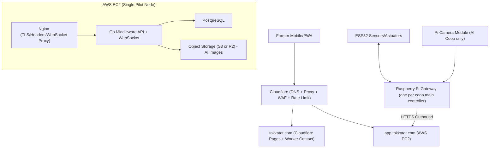

# Tokkatot Next-Phase Blueprint (3-Month Pilot)

This document is the execution blueprint for Tokkatot's next phase. It aligns architecture, security, delivery flow, testing, and technical budget planning for a 3-month pilot rollout.

---

## 1) Mission and Scope

### Mission
Deliver a stable, secure, multi-tenant poultry platform where each farm can control and monitor coops remotely through one cloud backend.

### Scope (This Phase)
- Launch and operate one shared production environment for pilot farms.
- Support 2-3 pilot farms with coop-level automation.
- Deploy one AI-enabled pilot setup (Pi 5 + AI HAT+ + camera).
- Finish critical unfinished software:
  - landing page production quality (existing Cloudflare Pages + Worker flow)
  - core web app hardening and QA
  - AI service integration path (even if staged behind feature flag)
- Establish security and retention controls so data does not leak across farms/coops.

### Out of Scope (This Phase)
- One server per farm
- Full microservices split
- GPU cloud inference at scale
- Large MLOps platform

---

## 2) Target Architecture

### Architecture Notes
- `tokkatot.com` remains on Cloudflare Pages for landing and public website.
- `app.tokkatot.com` points to EC2 via Cloudflare proxy.
- Pilot keeps a single EC2 node to control cost and complexity.
- One coop has one main controller gateway; cloud remains shared multi-tenant.
- AI images are not stored in PostgreSQL blobs; store metadata in Postgres and files in object storage.

---

## 3) Security Model (No Cross-Farm Leakage)

### Threats to Address
- Unauthorized control attempts from outside internet.
- Cross-tenant data leakage between farms/coops.
- Token abuse or replay from compromised gateway.
- Neighbor/local network interference with farm hardware.

### Controls at the Edge (Cloudflare)
- Proxy enabled for `app.tokkatot.com`.
- SSL mode set to Full (strict).
- WAF managed rules enabled.
- Rate limits for:
  - login/signup
  - gateway provisioning endpoints
  - command endpoints
- Bot/challenge control for suspicious bursts.

### Controls at Origin (EC2)
- Only `80/443` exposed publicly.
- SSH (`22`) restricted to maintainers' fixed IPs.
- PostgreSQL never exposed publicly.
- Fail2ban or equivalent host hardening for brute-force resistance.
- Automatic security updates and patch window.

### App-Level Authorization (Most Critical)
- Every read/write endpoint must verify:
  - authenticated user
  - membership to farm
  - access to target coop/device
- Never trust farm/coop IDs from client without server-side ownership validation.
- Command execution must bind to `farm_id + coop_id + device_id + issued_by`.
- Audit log every critical action.

### Gateway Trust Model
- Each gateway has unique identity (`hardware_id`) and token.
- Gateway only polls and executes commands assigned to its own mapping.
- ESP32 endpoints remain local only; no internet exposure from farm LAN.
- Roadmap hardening: rotate gateway tokens and add signed request verification.

---

## 4) Data Strategy and Retention

### Data Classes
1. Account/tenant data: users, farms, coops, memberships.
2. Operational control data: devices, commands, schedules, alerts.
3. Telemetry time-series: temperature/humidity/water readings.
4. AI image data: captured images and model outputs.

### Storage Placement
- PostgreSQL:
  - tenant/core entities
  - command and audit history
  - telemetry summaries
  - AI metadata (labels, confidence, storage key, consent state)
- Local Pi SQLite:
  - temporary offline queue only
  - flush to cloud when online
- Object storage (S3 or R2):
  - AI image files and derived artifacts

### Retention Policy (Pilot Defaults)
- Raw telemetry: 30-90 days (configurable by budget).
- Aggregated telemetry (hourly/daily): 12-24 months.
- AI images for training: retained long-term (no auto-delete) with lifecycle tiering.
- Local gateway queue: short-lived, auto-pruned after sync success.

### Data Governance Minimums
- Add consent text in app policy/terms for retaining AI images for model improvement.
- Store data lineage metadata: capture timestamp, coop, source gateway, model version, annotation status.

---

## 5) Infrastructure Options for 3-Month Pilot

### Option A (Lean Default)
- One EC2 instance (ARM Graviton class).
- One encrypted EBS volume.
- Postgres on same host.
- Nginx reverse proxy + middleware containers.
- Object storage for AI images.

Use when:
- pilot traffic is low
- budget is constrained
- fast execution is priority

### Option B (Safer Ops)
- Option A + separate staging environment.
- Automatic DB snapshots + restore drills.
- Basic monitoring/alerts.

Use when:
- frequent changes expected
- team wants safer release flow

### Option C (Scale-Ready Baseline)
- Split DB from app node.
- Managed DB and stronger HA plan.

Use when:
- pilot success is confirmed and traffic/tenants grow.

Recommendation for this phase: start with Option A and add selected Option B controls.

---

## 6) Development Flow for Next Phase

### Delivery Rhythm
- Weekly planning: priorities, blockers, budget burn.
- Daily quick sync: status by stream (cloud/app/gateway/AI/hardware testing).
- End-of-week demo + risk review.

### Streams
1. Cloud & DevOps stream
2. Core app/API stream
3. Gateway/embedded stream
4. AI stream
5. QA + field validation stream

### Phase Plan (12 Weeks)

#### Phase 1 (Weeks 1-2): Foundation Hardening
- Finalize DNS and Cloudflare edge security.
- Stabilize production compose deployment.
- Lock server/network baselines.
- Confirm backup and restore procedure.

#### Phase 2 (Weeks 3-5): Multi-Tenant and Control Safety
- Review and patch ownership checks in all protected endpoints.
- Strengthen gateway provisioning and command authorization.
- Add audit coverage for sensitive operations.

#### Phase 3 (Weeks 6-8): Pilot Farm Rollout
- Deploy 2 standard farm setups.
- Validate remote control, offline sync, and alerting.
- Capture real-world failures and iterate.

#### Phase 4 (Weeks 9-10): AI Farm Integration
- Deploy Pi 5 + AI HAT+ + camera workflow.
- Connect image upload path and metadata tracking.
- Validate AI inference and fallback behavior.

#### Phase 5 (Weeks 11-12): Stabilization and Handover
- Bug burn-down.
- Performance and resilience checks.
- Documentation and operational handover pack.

---

## 7) Definition of Done (DoD) Gates

### Gate A: Cloud Ready
- `app.tokkatot.com` stable behind Cloudflare.
- HTTPS and WebSocket verified.
- Database private-only access confirmed.

### Gate B: Multi-Tenant Safe
- No endpoint allows cross-farm data access in validation tests.
- Role checks validated (owner/worker/viewer).
- Command path includes farm+coop authorization checks.

### Gate C: Pilot Hardware Stable
- 2 standard farms pass 7-day reliability observation.
- Offline telemetry queue recovers after simulated disconnect.

### Gate D: AI Pilot Functional
- AI farm image ingestion to object storage works.
- Metadata written to Postgres and searchable by farm/coop/time.
- Inference results visible in app/log pipeline.

### Gate E: Ops Ready
- Backup and restore tested.
- Incident runbook available.
- Retention and storage lifecycle rules enabled.

---

## 8) Test Strategy (Software + Hardware + R&D)

### Software Validation
- API auth and permission tests for all farm/coop-scoped endpoints.
- Command issuance/execution flow tests.
- WebSocket event tests.
- Regression checks before each production deploy.

### Hardware Validation
- Sensor read stability tests (temperature/humidity/water).
- Relay actuation reliability tests (fan/heater/feeder/conveyor).
- Gateway reconnection and queue-drain tests.
- Long-run soak tests on pilot farms.

### Security Validation
- Attempt cross-farm read/write with mismatched tokens and IDs.
- Brute-force and rate-limit validation.
- Verify no direct database/public admin exposure.

### AI Validation
- Camera capture quality checks and low-light edge cases.
- Inference throughput on Pi 5 AI setup.
- Data-label quality loop for future training dataset.

---

## 9) Technical Budget Template (No Man-Day)

Use the fillable templates:
- `docs/04_BUDGET_SHEET_TEMPLATE.md`
- `docs/04_BUDGET_SHEET_TEMPLATE.csv`

### Cloud Infrastructure (3 Months)
- EC2 compute
- EBS block storage
- Public IPv4
- Backups/snapshots
- Object storage for AI images
- Bandwidth and headroom reserve

### Software Platform
- Domain/DNS/security services (if paid tier used)
- Build/deploy tooling (if paid tier used)
- Observability tooling (if paid tier used)

### Hardware and R&D
- Standard gateway kits (x2)
- AI gateway kit (x1)
- Sensors, relays, wiring, enclosures
- Spares and failure replacement pool
- Lab/field test consumables

### Recommended Budget Guardrails
- Keep 10-15% contingency for failed components and field surprises.
- Prefer monthly or short commitment billing during pilot.
- Avoid 3-year cloud commitments before pilot KPI validation.

---

## 10) KPI and Success Criteria

### Reliability
- >= 99% cloud uptime during pilot window.
- >= 95% successful command execution in field conditions.

### Safety and Isolation
- Zero confirmed cross-farm data leakage incidents.
- Zero unauthorized coop control incidents.

### Operational Outcomes
- 2-3 farms onboarded and active.
- 1 AI-enabled farm producing usable retained training data.
- Stable weekly release flow with rollback ability.

---

## 11) Operational Runbook (Minimum)

### Daily
- Check service health, failed command counts, and queue backlog.
- Review error logs and security events.

### Weekly
- Backup status review.
- Storage growth review (DB and object storage).
- Security patch and dependency review.

### Incident Priority
1. Unauthorized control or data leak
2. Cloud outage or command pipeline failure
3. Telemetry delay/degradation
4. AI pipeline degradation

---

## 12) Alignment Checklist (Use in Weekly Review)

- Are we still inside agreed scope for this phase?
- Are budgets still aligned with pilot goals?
- Are security controls enforced at edge + app + gateway?
- Are retention rules active and audited?
- Are we collecting training-quality AI data with metadata?
- Are blockers captured with owners and due dates?

If any answer is "no", create corrective action in the same review cycle.

---

## 13) Next-Phase Backlog (After Pilot)

- Introduce stronger key rotation and signed gateway requests.
- Add row-level security policy hardening in PostgreSQL.
- Split DB and app node if load or risk demands.
- Build AI dataset curation and labeling workflow.
- Add model versioning and controlled rollout gates.

---

**Document Owner:** Tokkatot Core Team  
**Review Frequency:** Weekly during pilot  
**Last Updated:** 2026-04-10
