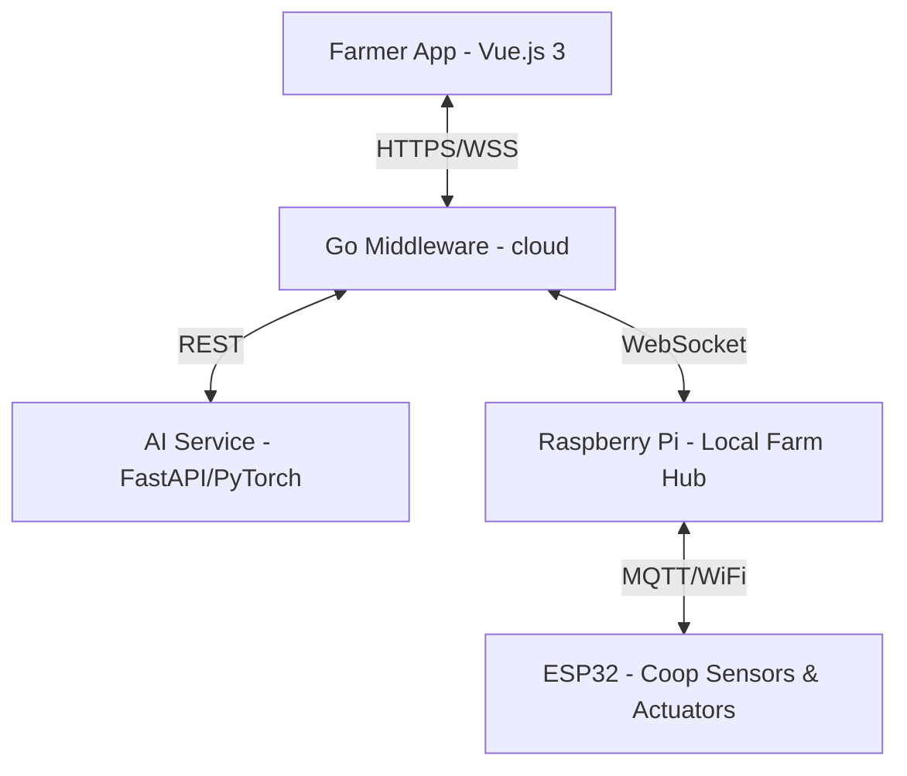

# 🏗️ Tokkatot System Architecture

This file mirrors `ARCHITECTURE.md` at the repository root.  
Keep both files in sync when architecture changes.

---

## 🏗️ System Overview

Tokkatot is designed as a multi-tier IoT system centered around local farm coops, with centralized cloud management.

### 📊 Data Hierarchy
1.  **User**: A farmer or worker with a phone number and password.
2.  **Farm**: A physical location owned by a User.
3.  **Coop**: A bird-housing unit within a farm. Devices are assigned to Coops.
4.  **Device**: Sensors (DHT22, Water Level) or Actuators (Pumps, Fans, Feeders).

---

## 🗄️ Database Design (PostgreSQL)

The system uses a **Unified Schema** where user identity and farm ownership are tightly integrated.

### Master Tables
| Table | Description |
|---|---|
| `users` | Unified User & Profile data (merged from farmer_profiles). |
| `farms` | Owners, locations, and settings. |
| `coops` | Environmental grouping for devices. |
| `devices` | Hardware registry (ESP32s, Sensors, Actuators). |
| `device_commands` | Audit log of all actions taken (Manual & Automated). |
| `schedules` | Automation rules (Time-based, Condition-based, etc.). |
| `alerts` | Real-time sensor threshold violations. |

---

## 🌐 API & Communication

### REST Endpoints (`/v1/`)
- **Auth**: `/v1/auth/signup`, `/v1/auth/login`, `/v1/auth/refresh`, `/v1/auth/logout` (no email/SMS verification).
- **User**: `/v1/users/me`, `/v1/users/sessions`.
- **Farms**: `/v1/farms`, `/v1/farms/:id/members`.
- **Devices**: `/v1/farms/:id/devices`, `/v1/farms/:id/devices/:id/commands`.
- **Schedules**: `/v1/farms/:id/schedules`.

### WebSocket (Real-time)
- **Endpoint**: `/v1/ws`
- **Hub**: Manages live updates for device states and alerts.
- **Client**: Subscribes to farm/coop updates for instant UI reflection.

---

## 🤖 AI Disease Detection

The AI Service is a **Python FastAPI** application running a **PyTorch Ensemble** model.
- **Backbone**: EfficientNetB0 + DenseNet121.
- **Input**: 224x224 RGB image of manure.
- **Output**: Classification of 5 diseases (Healthy, Newcastle, Coccidiosis, etc.) with confidence scores.

---

## 📡 Embedded & IoT

- **Platform**: ESP32 (ESP-IDF).
- **Protocol**: MQTT over local WiFi.
- **Logic**: Idempotent command execution (ON/OFF/PWM/Sequence).
- **Heartbeat**: 30s heartbeat to maintain "online" status in the dashboard.

---

**Proprietary Software - Tokkatot Startup**  
*Designed for reliability, accessibility, and high impact in Cambodian agriculture.*
