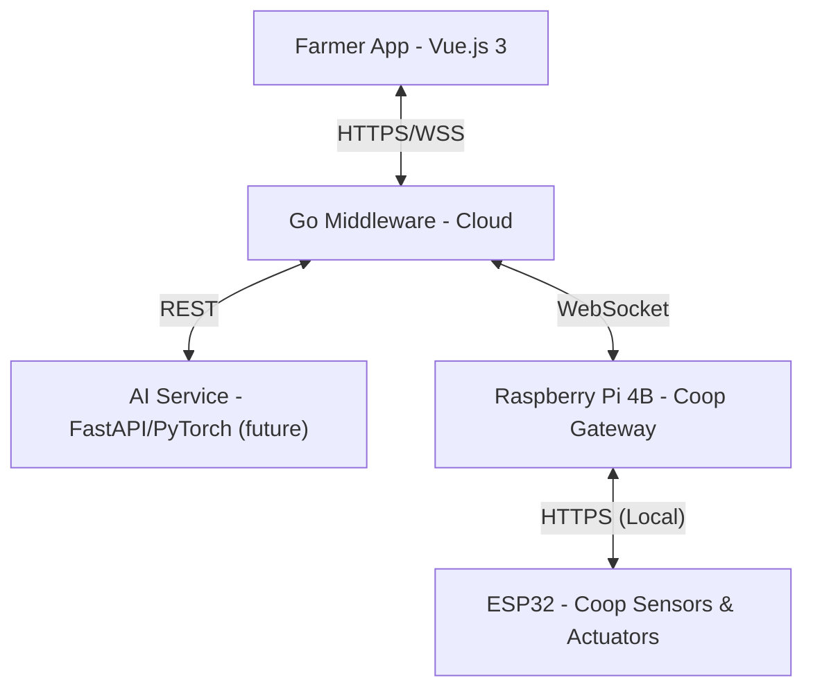

# 🏗️ Tokkatot System Architecture

This file mirrors `ARCHITECTURE.md` at the repository root.  
Keep both files in sync when architecture changes.

---

## 🏗️ System Overview

Tokkatot is designed as a multi-tier IoT system centered around local farm coops, with centralized cloud management.

### 📊 Data Hierarchy
1.  **User**: Farmer or worker (role-based access).
2.  **Farm**: Container for coops and ownership.
3.  **Coop**: Primary control unit. All automation is coop-level.
4.  **Device**: Sensors/actuators assigned to coops. Missing devices are allowed and marked inactive.

---

## 🗄️ Database Design (PostgreSQL)

The system uses a **Unified Schema** where user identity and farm ownership are tightly integrated.

### Master Tables
| Table | Description |
|---|---|
| `users` | Unified User & Profile data (merged from farmer_profiles). |
| `farms` | Owners, locations, and settings. |
| `coops` | Environmental grouping for devices. |
| `devices` | Hardware registry (ESP32s, Sensors, Actuators). |
| `device_commands` | Audit log of all actions taken (Manual & Automated). |
| `schedules` | Automation rules (Time-based, Condition-based, etc.). |
| `alerts` | Real-time sensor threshold violations. |

---

## 🌐 API & Communication

### REST Endpoints (`/v1/`)
- **Auth**: `/v1/auth/signup`, `/v1/auth/login`, `/v1/auth/refresh`, `/v1/auth/logout` (no email/SMS verification).
- **User**: `/v1/users/me`, `/v1/users/sessions`.
- **Farms**: `/v1/farms`, `/v1/farms/:id/members`.
- **Devices**: `/v1/farms/:id/devices`, `/v1/farms/:id/devices/:id/commands`.
- **Schedules**: `/v1/farms/:id/schedules` (coop-level execution).
- **Telemetry**: `/v1/farms/:farm_id/coops/:coop_id/telemetry` (gateway → cloud).
- **Device Report**: `/v1/farms/:farm_id/coops/:coop_id/devices/report` (gateway → cloud).
- **Monitoring Timeline**: `/v1/farms/:farm_id/coops/:coop_id/temperature-timeline`.

### WebSocket (Real-time)
- **Endpoint**: `/v1/ws`
- **Hub**: Manages live updates for device states and alerts.
- **Client**: Subscribes to farm/coop updates for instant UI reflection.

---

## 🤖 AI Disease Detection

The AI Service is planned for a later patch and is **not integrated yet**.

---

## 📡 Embedded & IoT

- **Platform**: ESP32 (ESP-IDF) + Raspberry Pi 4B gateway.
- **Protocol**: ESP32 exposes local HTTPS endpoints; Pi polls sensors and executes commands.
- **Logic**: ON/OFF relays + sequence schedules executed by gateway.
- **Telemetry**: Pi posts temperature/humidity/water level to cloud.
- **Water Alert Rule**: Water below half threshold for 1 minute triggers alert.
- **Gateway Security (planned)**: per-gateway key + HMAC signature + nonce/replay protection.

---

**Proprietary Software - Tokkatot Startup**
*Designed for reliability, accessibility, and high impact in Cambodian agriculture.*
