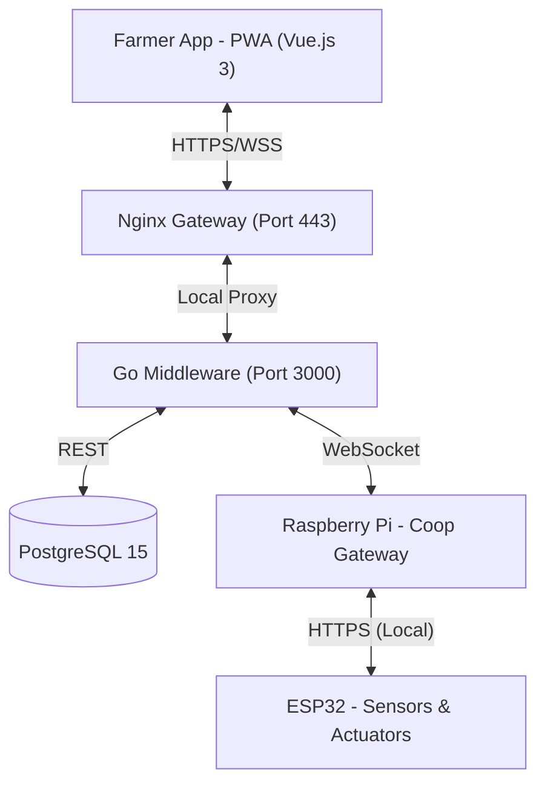

# 🏗️ Tokkatot System Architecture

This file provides a technical deep-dive into the Tokkatot platform's production-ready architecture.

---

## 🏗️ System Overview

Tokkatot is a multi-tier IoT system centered around local farm coops, with centralized cloud management and automated CI/CD.

### 📊 Data Hierarchy
1.  **User**: Identity and role-based access control.
2.  **Farm**: The primary organizational unit for ownership and physical location.
3.  **Coop**: The operational unit. All automation rules are tied to the coop.
4.  **Device**: Sensors or actuators assigned to specific coops.

---

## 🌐 API & Communication

### REST Endpoints (`/v1/`)
-   **System Health**: `/v1/health` (Uptime & Monitoring).
-   **Auth**: `/v1/auth/signup` (Enforced Reg Keys), `/v1/auth/login`, `/v1/auth/refresh`, `/v1/auth/logout`.
-   **User**: `/v1/users/me` (Profile), `/v1/users/sessions`, `/v1/users/activity-log`.
-   **Farms**: `/v1/farms` (CRUD), `/v1/farms/:id/members`.
-   **Devices**: `/v1/farms/:id/devices`, `/v1/farms/:id/devices/:id/commands`.
-   **Telemetry**: `/v1/farms/:farm_id/coops/:coop_id/telemetry` (Gateway Ingestion).
-   **Monitoring**: `/v1/farms/:id/dashboard`, `/v1/farms/:id/coops/:id/temperature-timeline`.

### WebSocket (Real-time)
-   **Endpoint**: `/v1/ws`
-   **Usage**: Real-time status synchronization between the farmer UI and the IoT hardware via the middleware hub.

---

## 🛠️ Infrastructure & CI/CD

### Docker Deployment
The system is fully containerized for reliability:
-   **Nginx**: Handles SSL termination and security headers.
-   **Middleware**: Go binary running in a lightweight Alpine container.
-   **PostgreSQL**: Uses persistent named volumes to ensure no data loss during updates.

### GitHub Actions Pipeline
Automated build and deployment flow:
-   **Branches**: `main` (Production), `dev` (Development).
-   **Registry**: Images are built and stored in **GitHub Container Registry (GHCR)**.
-   **Deployment**: Automated via SSH to the target server using `docker-compose.yml`.

---

## 🔐 Security Hardening

-   **Pre-render Auth**: Every protected PWA page contains a blocking `<script>` in the `<head>` that verifies the `access_token` before the UI renders.
-   **Network Isolation**: The application database and middleware are NOT accessible from the public internet; only the Nginx gateway is exposed on port 443.
-   **Registration Key system**: Prevents unauthorized account creation by requiring validated physical keys.

---
**Proprietary Software - Tokkatot Startup**
*Designed for reliability, accessibility, and high impact in Cambodian agriculture.*
